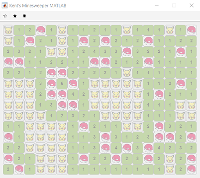

# Minesweeper-MATLAB
Minesweeper with GUI written to practice MATLAB.   
 
  

# How to Run  
Open MATLAB, navigate to the directory, then  
`>> execute`

# Image Credit  
easy.svg, hard.svg, medium.svg: [Noun Project](https://thenounproject.com/)  
pikachu.png: [icons8](https://cdn-icons-png.flaticon.com/512/528/528098.png)  
voltorb.svg: [seeklogo](https://seeklogo.com/vector-logo/286585/voltorb)  

---

# Function Stubs Backend  
In expected order of execution  
- [x] setDifficulty: decide the r, c and number of mines to be passed to build functions  
- [x] buildMineMap: initiate mine locations as a matrix at the beginning of each game  
- [x] getAdjacentFragment: return a fragment matrix, for checking of adjacent cells, in getAdjacentMineCount and getZeroPool  
- [x] buildAdjacentMineCount: return a matrix, with entry showing number of adjacent mines, to be displayed to player  
- [x] buildInitialDisplay: initiate current display at the beginning, all 0, 0 means unrevealed, 1 means revealed  
- [x] getSafeSpotNum: return number of safe cell to be revealed before victory  
- [x] isProceed: return true if okay, return false if lose, executed every time the player make a choice  
- [x] getZeroPool: this will return a cell array containing the [r,c] of connected zeros of selected cell  
- [x] getZeroPoolFirstLayer: return a cell array containing the [r,c] of layer surrounding inputed zero pool   
- [x] getUpdatedDisplay: return a matrix, 0 means closed, 1 means revealed, responding to user's choice, including lose  

# Function Stubs Frontend  
- [x] execute.m: run this on MATLAB to play the game  

# Upcoming Changes   
- [ ] Click events, including RC flag that disables clicking, and hover effect  
- [ ] Flags remaining, smiley/crying face, time  
